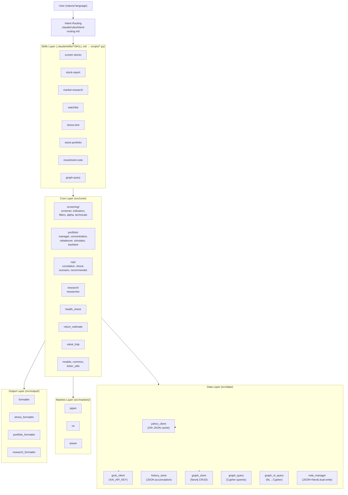

# Architecture

## System Overview

A natural-language-first investment analysis system. Users simply express their intent in plain language and screening, individual stock analysis, portfolio management, risk assessment, and knowledge graph queries are executed automatically.

Runs as Claude Code Skills, integrating Yahoo Finance API (yfinance) + Grok API (X/Web search) + Neo4j (knowledge graph) + TEI (vector search, KIK-420).

---

## Layer Architecture



---

## Data Flow

```
1. User input
   ↓
2. Auto Context Injection (graph-context.md + scripts/get_context.py)
   ├─ Detect ticker/company name → query Neo4j → retrieve past context
   └─ Skill recommendations based on graph state
   ↓
3. Intent Routing (intent-routing.md)
   ├─ Domain classification (discovery / analysis / portfolio / risk / watchlist / notes / knowledge / meta)
   └─ Skill selection + parameter inference (graph recommendation + user intent for final decision)
   ↓
4. Skill Script (scripts/*.py)
   ├─ argparse CLI
   └─ src/ imported via sys.path.insert
   ↓
5. Core Module (src/core/)
   ├─ Execute business logic
   └─ Fetch data via Data Layer
   ↓
6. Data Layer (src/data/)
   ├─ yahoo_client: yfinance + 24h JSON cache
   ├─ grok_client: Grok API (X/Web search)
   ├─ graph_store: Neo4j CRUD (MERGE-based)
   └─ history_store: JSON accumulation of execution results
   ↓
7. Output Layer (src/output/)
   └─ Format as Markdown tables / reports
   ↓
8. Display results + auto-accumulate to history_store / graph_store
```

---

## Design Principles

### 1. Natural Language First
The user interface is natural language. Slash commands are internal implementation and invisible to users. `intent-routing.md` is the sole entry point.

### 2. Dual-Write Pattern (JSON master + Neo4j view)
- JSON files are the master data source (writes always succeed)
- Neo4j is the view (for search and association). Graceful degradation via try/except
- All features work even when Neo4j is down

### 3. HAS_MODULE Graceful Degradation
Script layer (run_*.py) checks for module availability via `try/except ImportError`:
```python
try:
    from src.data import graph_store
    HAS_GRAPH = True
except ImportError:
    HAS_GRAPH = False
```

### 4. 24h JSON Cache
The `yahoo_client/` package (KIK-449) caches responses as JSON in `data/cache/` with a 24-hour TTL. Avoids API rate limits while maintaining sufficient freshness.

### 5. Idempotent Graph Writes
All writes in `graph_store.py` are MERGE-based. Writing the same data multiple times produces no side effects.

---

## Module Summary

### Core Modules (src/core/)

| Subfolder | Module | Role |
|:---|:---|:---|
| screening/ | screener.py | 8 screeners (Query/Value/Pullback/Alpha/Growth/Trending/Contrarian/Momentum) |
| screening/ | indicators.py | Value score (0–100) + shareholder return rate + stability |
| screening/ | filters.py | Fundamentals condition filter |
| screening/ | query_builder.py | EquityQuery construction |
| screening/ | alpha.py | Change score (accruals / revenue acceleration / FCF / ROE trend) |
| screening/ | technicals.py | Pullback detection (RSI/BB/bounce score) |
| portfolio/ | portfolio_manager.py | CSV-based portfolio management |
| portfolio/ | concentration.py | HHI concentration analysis |
| portfolio/ | rebalancer.py | Risk-constrained rebalancing suggestions |
| portfolio/ | simulator.py | Compound interest simulation (3 scenarios + dividend reinvestment + DCA) |
| portfolio/ | backtest.py | Return verification from accumulated data |
| portfolio/ | portfolio_simulation.py | What-If simulation |
| portfolio/ | portfolio_bridge.py | Portfolio CSV → stress test integration |
| risk/ | correlation.py | Daily returns, correlation matrix, factor decomposition |
| risk/ | shock_sensitivity.py | Shock sensitivity score |
| risk/ | scenario_analysis.py | Scenario analysis (execution logic) |
| risk/ | scenario_definitions.py | 8 scenarios + ETF asset class definitions |
| risk/ | recommender.py | Rule-based recommended actions |
| research/ | researcher.py | yfinance + Grok API integrated research |
| (root) | health_check.py | 3-level alerts + cross detection + return stability |
| (root) | return_estimate.py | Analyst + historical returns + news + X sentiment |
| (root) | value_trap.py | Value trap detection |
| (root) | models.py | dataclass definitions |
| (root) | common.py | Common utilities |
| (root) | ticker_utils.py | Ticker inference (currency/region mapping) |

### Data Modules (src/data/)

| Module | Role |
|:---|:---|
| yahoo_client/ | yfinance wrapper + 24h JSON cache + anomaly guard (KIK-449: split into detail/screen/history/macro/_cache/_normalize) |
| grok_client.py | Grok API (X search/Web search) + XAI_API_KEY environment variable |
| grok_context.py | Compact context extraction for Grok prompts (Neo4j → 300-token summary, KIK-488) |
| history_store.py | Auto JSON accumulation of skill execution results (data/history/) |
| graph_store.py | Neo4j CRUD (21 node types, MERGE-based, vector indexes (KIK-420)) |
| graph_query.py | Neo4j query helpers (6 functions + vector_search (KIK-420)) |
| graph_nl_query.py | Natural language → Cypher template matching |
| note_manager.py | Investment note management (JSON + Neo4j dual-write) |
| auto_context.py | Auto context injection (hybrid search: symbol + vector (KIK-420), freshness judgment (KIK-427)) |
| embedding_client.py | TEI REST API client (384-dimension vector generation, KIK-420) |
| summary_builder.py | Per-node-type semantic_summary template builder (KIK-420) |

### Config

| File | Contents |
|:---|:---|
| config/screening_presets.yaml | 15 preset definitions |
| config/exchanges.yaml | Exchange and threshold definitions for 60+ regions |
