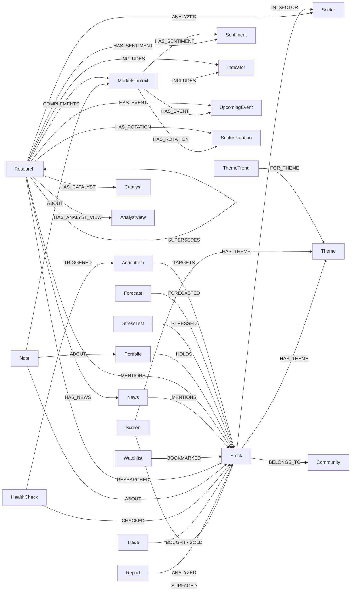

# Neo4j Knowledge Graph Schema

Schema reference for the investment knowledge graph. Defined and managed by `src/data/graph_store.py`.

---

## Node Types (24)

### Stock
The central node. All activities connect to this node.

| Property | Type | Description |
|:---|:---|:---|
| symbol | string (UNIQUE) | Ticker symbol (e.g. 7203.T, AAPL) |
| name | string | Stock name |
| sector | string | Sector |
| country | string | Country |

### Screen
Screening execution results.

| Property | Type | Description |
|:---|:---|:---|
| id | string (UNIQUE) | `screen_{date}_{region}_{preset}` |
| date | string | Execution date (YYYY-MM-DD) |
| preset | string | Preset name (alpha, value, etc.) |
| region | string | Region (japan, us, etc.) |
| count | int | Number of hits |

### Report
Individual stock report. Extended properties available in full mode.

| Property | Type | Description |
|:---|:---|:---|
| id | string (UNIQUE) | `report_{date}_{symbol}` |
| date | string | Execution date |
| symbol | string | Target ticker |
| score | float | Value score (0–100) |
| verdict | string | Judgment (undervalued / fair / overvalued) |
| price | float | Stock price (full mode only) |
| per | float | P/E ratio (full mode only) |
| pbr | float | P/B ratio (full mode only) |
| dividend_yield | float | Dividend yield (full mode only) |
| roe | float | ROE (full mode only) |
| market_cap | float | Market cap (full mode only) |

### Trade
Buy/sell records.

| Property | Type | Description |
|:---|:---|:---|
| id | string (UNIQUE) | `trade_{date}_{type}_{symbol}` |
| date | string | Trade date |
| type | string | buy / sell |
| symbol | string | Ticker |
| shares | int | Number of shares |
| price | float | Trade price |
| currency | string | Currency (JPY/USD/SGD) |
| memo | string | Note |

### HealthCheck
Health check execution results.

| Property | Type | Description |
|:---|:---|:---|
| id | string (UNIQUE) | `health_{date}` |
| date | string | Execution date |
| total | int | Number of tickers checked |
| healthy | int | Number of healthy tickers |
| exit_count | int | Number of EXIT judgments |

### Note
Investment notes.

| Property | Type | Description |
|:---|:---|:---|
| id | string (UNIQUE) | UUID |
| date | string | Creation date |
| type | string | thesis/observation/concern/review/target/lesson/journal |
| content | string | Note content |
| source | string | Information source |
| category | string | Category (stock/portfolio/market/general) (KIK-473) |

### Theme
Theme tags attached to stocks.

| Property | Type | Description |
|:---|:---|:---|
| name | string (UNIQUE) | Theme name (e.g. AI, EV, semiconductors) |

### Sector
Sector classification.

| Property | Type | Description |
|:---|:---|:---|
| name | string (UNIQUE) | Sector name (e.g. Technology, Healthcare) |

### Research
Deep research results.

| Property | Type | Description |
|:---|:---|:---|
| id | string (UNIQUE) | `research_{date}_{type}_{target}` |
| date | string | Execution date |
| research_type | string | stock/industry/market/business |
| target | string | Target (ticker / industry name / market name) |
| summary | string | Summary |

### Watchlist
Watchlist.

| Property | Type | Description |
|:---|:---|:---|
| name | string (UNIQUE) | List name |

### MarketContext
Market context snapshot.

| Property | Type | Description |
|:---|:---|:---|
| id | string (UNIQUE) | `market_context_{date}` |
| date | string | Retrieval date |
| indices | string (JSON) | Index data (JSON string) |

### News (KIK-413 full mode)
News articles. Connected from Research via HAS_NEWS.

| Property | Type | Description |
|:---|:---|:---|
| id | string (UNIQUE) | `{research_id}_news_{i}` |
| date | string | Record date |
| title | string | Headline (max 500 chars) |
| source | string | Source (grok/yahoo/publisher name) |
| link | string | URL |

### Sentiment (KIK-413 full mode)
Sentiment analysis results. Connected from Research/MarketContext via HAS_SENTIMENT.

| Property | Type | Description |
|:---|:---|:---|
| id | string (UNIQUE) | `{parent_id}_sent_{source}` |
| date | string | Record date |
| source | string | grok_x / yahoo_x / market |
| score | float | Score (0.0–1.0) |
| summary | string | Summary |
| positive | string | Positive factors (yahoo_x only) |
| negative | string | Negative factors (yahoo_x only) |

### Catalyst (KIK-413 full mode, KIK-430 extended)
Positive/negative catalysts. Connected from Research via HAS_CATALYST.
stock/business: positive/negative. industry: trend/growth_driver/risk/regulatory.

| Property | Type | Description |
|:---|:---|:---|
| id | string (UNIQUE) | `{research_id}_cat_{type}_{i}` |
| date | string | Record date |
| type | string | positive / negative / trend / growth_driver / risk / regulatory |
| text | string | Content (max 500 chars) |

### AnalystView (KIK-413 full mode)
Analyst opinions. Connected from Research via HAS_ANALYST_VIEW.

| Property | Type | Description |
|:---|:---|:---|
| id | string (UNIQUE) | `{research_id}_av_{i}` |
| date | string | Record date |
| text | string | Opinion text (max 500 chars) |

### Indicator (KIK-413 full mode, KIK-430 extended)
Macro indicator snapshot. Connected from MarketContext/Research(market) via INCLUDES.

| Property | Type | Description |
|:---|:---|:---|
| id | string (UNIQUE) | `{context_id}_ind_{i}` |
| date | string | Record date |
| name | string | Indicator name (e.g. S&P500, Nikkei 225) |
| symbol | string | Symbol (e.g. ^GSPC) |
| price | float | Value |
| daily_change | float | Daily change rate |
| weekly_change | float | Weekly change rate |

### UpcomingEvent (KIK-413 full mode)
Upcoming events. Connected from MarketContext via HAS_EVENT.

| Property | Type | Description |
|:---|:---|:---|
| id | string (UNIQUE) | `{context_id}_event_{i}` |
| date | string | Record date |
| text | string | Event content |

### SectorRotation (KIK-413 full mode)
Sector rotation information. Connected from MarketContext via HAS_ROTATION.

| Property | Type | Description |
|:---|:---|:---|
| id | string (UNIQUE) | `{context_id}_rot_{i}` |
| date | string | Record date |
| text | string | Rotation content |

### Portfolio (KIK-414)
Portfolio anchor node. Connected to held stocks via HOLDS relationship.

| Property | Type | Description |
|:---|:---|:---|
| name | string (UNIQUE) | Portfolio name (default: "default") |

### StressTest (KIK-428)
Stress test execution results. Connected to target stocks via STRESSED relationship.

| Property | Type | Description |
|:---|:---|:---|
| id | string (UNIQUE) | `stress_test_{date}_{scenario}` |
| date | string | Execution date (YYYY-MM-DD) |
| scenario | string | Scenario name (triple meltdown, tech crash, etc.) |
| portfolio_impact | float | Estimated portfolio loss rate |
| var_95 | float | 95% VaR (daily) |
| var_99 | float | 99% VaR (daily) |
| symbol_count | int | Number of target tickers |

### Forecast (KIK-428)
Forecast (future projection) execution results. Connected to target stocks via FORECASTED relationship.

| Property | Type | Description |
|:---|:---|:---|
| id | string (UNIQUE) | `forecast_{date}` |
| date | string | Execution date (YYYY-MM-DD) |
| optimistic | float | Optimistic scenario estimated return (%) |
| base | float | Base scenario estimated return (%) |
| pessimistic | float | Pessimistic scenario estimated return (%) |
| total_value_jpy | float | Portfolio market value (JPY) |
| symbol_count | int | Number of target tickers |

### ActionItem (KIK-472)
Action items (auto-detected from proactive suggestions). Connected to target stocks via TARGETS relationship. Can be linked to Linear issues.

| Property | Type | Description |
|:---|:---|:---|
| id | string (UNIQUE) | `action_{date}_{trigger_type}_{symbol}` |
| date | string | Detection date (YYYY-MM-DD) |
| trigger_type | string | Trigger type (exit/earnings/thesis_review/concern) |
| title | string | Action item title |
| symbol | string | Target ticker symbol |
| urgency | string | Urgency (high/medium/low) |
| status | string | Status (open/done) |
| linear_issue_id | string | Linear issue ID |
| linear_issue_url | string | Linear issue URL |
| linear_identifier | string | Linear issue identifier (e.g. KIK-999) |

### Community (KIK-547)
Stock clusters. Similar stock groups based on co-occurrence signals (Screen/Theme/Sector/News).

| Property | Type | Description |
|:---|:---|:---|
| id | string (UNIQUE) | `community_{level}_{index}` |
| name | string | Auto-named (from common sector/theme) |
| size | int | Number of member stocks |
| level | int | Hierarchy level (0 = finest) |
| created_at | string | Creation datetime (ISO 8601) |

### ThemeTrend (KIK-603)
Theme trend detection records. Records trending themes detected by Grok during `--auto-theme` execution. Connected to Theme node via FOR_THEME relationship.

| Property | Type | Description |
|:---|:---|:---|
| id | string (UNIQUE) | `theme_trend_{date}_{theme}_{region}` |
| date | string | Detection date (YYYY-MM-DD) |
| theme | string | Theme key (e.g. ai, ev, cybersecurity) |
| confidence | float | Grok confidence (0.0–1.0) |
| reason | string | Reason for attention |
| rank | int | Rank within detection batch (1 = highest confidence) |
| region | string | Target region (e.g. japan, us) |

---

## Relationships



| Relationship | From | To | Description |
|:---|:---|:---|:---|
| SURFACED | Screen | Stock | Detected by screening |
| ANALYZED | Report | Stock | Analyzed in report |
| BOUGHT | Trade | Stock | Buy transaction |
| SOLD | Trade | Stock | Sell transaction |
| CHECKED | HealthCheck | Stock | Health check target |
| ABOUT | Note | Stock/Portfolio/MarketContext | Note target (stock / portfolio / market context) (KIK-491) |
| IN_SECTOR | Stock | Sector | Sector classification |
| HAS_THEME | Stock/Screen | Theme | Theme tag |
| RESEARCHED | Research | Stock | Research target (stock/business type) |
| ANALYZES | Research | Sector | Industry research target (industry type) (KIK-491) |
| COMPLEMENTS | Research | MarketContext | Market research context (market type) (KIK-491) |
| BOOKMARKED | Watchlist | Stock | Watchlist target |
| SUPERSEDES | Research | Research | New/old research chain for the same target (chronological) |
| HAS_NEWS | Research | News | News linked to research (KIK-413) |
| MENTIONS | News | Stock | Stock mentioned in news (KIK-413) |
| HAS_SENTIMENT | Research/MarketContext | Sentiment | Sentiment analysis result (KIK-413) |
| HAS_CATALYST | Research | Catalyst | Positive/negative catalysts (KIK-413) |
| HAS_ANALYST_VIEW | Research | AnalystView | Analyst opinion (KIK-413) |
| INCLUDES | Research(market)/MarketContext | Indicator | Macro indicator value (KIK-413/430) |
| HAS_EVENT | Research(market)/MarketContext | UpcomingEvent | Upcoming event (KIK-413/430) |
| HAS_ROTATION | Research(market)/MarketContext | SectorRotation | Sector rotation (KIK-413/430) |
| MENTIONS | Research(industry) | Stock | Stock mentioned in industry research (KIK-430) |
| HOLDS | Portfolio | Stock | Currently held stock (KIK-414). Properties: shares, cost_price, cost_currency, purchase_date |
| STRESSED | StressTest | Stock | Stress test target stock (KIK-428). Property: impact (estimated loss rate) |
| FORECASTED | Forecast | Stock | Forecast target stock (KIK-428). Properties: optimistic, base, pessimistic (per-scenario returns) |
| BELONGS_TO | Stock | Community | Community membership (KIK-547) |
| FOR_THEME | ThemeTrend | Theme | Target theme of theme trend detection (KIK-603) |

---

## Constraints (24)

```cypher
CREATE CONSTRAINT stock_symbol IF NOT EXISTS FOR (s:Stock) REQUIRE s.symbol IS UNIQUE
CREATE CONSTRAINT screen_id IF NOT EXISTS FOR (s:Screen) REQUIRE s.id IS UNIQUE
CREATE CONSTRAINT report_id IF NOT EXISTS FOR (r:Report) REQUIRE r.id IS UNIQUE
CREATE CONSTRAINT trade_id IF NOT EXISTS FOR (t:Trade) REQUIRE t.id IS UNIQUE
CREATE CONSTRAINT health_id IF NOT EXISTS FOR (h:HealthCheck) REQUIRE h.id IS UNIQUE
CREATE CONSTRAINT note_id IF NOT EXISTS FOR (n:Note) REQUIRE n.id IS UNIQUE
CREATE CONSTRAINT theme_name IF NOT EXISTS FOR (t:Theme) REQUIRE t.name IS UNIQUE
CREATE CONSTRAINT sector_name IF NOT EXISTS FOR (s:Sector) REQUIRE s.name IS UNIQUE
CREATE CONSTRAINT research_id IF NOT EXISTS FOR (r:Research) REQUIRE r.id IS UNIQUE
CREATE CONSTRAINT watchlist_name IF NOT EXISTS FOR (w:Watchlist) REQUIRE w.name IS UNIQUE
CREATE CONSTRAINT market_context_id IF NOT EXISTS FOR (m:MarketContext) REQUIRE m.id IS UNIQUE
-- KIK-413 full-mode nodes
CREATE CONSTRAINT news_id IF NOT EXISTS FOR (n:News) REQUIRE n.id IS UNIQUE
CREATE CONSTRAINT sentiment_id IF NOT EXISTS FOR (s:Sentiment) REQUIRE s.id IS UNIQUE
CREATE CONSTRAINT catalyst_id IF NOT EXISTS FOR (c:Catalyst) REQUIRE c.id IS UNIQUE
CREATE CONSTRAINT analyst_view_id IF NOT EXISTS FOR (a:AnalystView) REQUIRE a.id IS UNIQUE
CREATE CONSTRAINT indicator_id IF NOT EXISTS FOR (i:Indicator) REQUIRE i.id IS UNIQUE
CREATE CONSTRAINT upcoming_event_id IF NOT EXISTS FOR (e:UpcomingEvent) REQUIRE e.id IS UNIQUE
CREATE CONSTRAINT sector_rotation_id IF NOT EXISTS FOR (r:SectorRotation) REQUIRE r.id IS UNIQUE
-- KIK-414 portfolio sync
CREATE CONSTRAINT portfolio_name IF NOT EXISTS FOR (p:Portfolio) REQUIRE p.name IS UNIQUE
-- KIK-428 stress test / forecast
CREATE CONSTRAINT stress_test_id IF NOT EXISTS FOR (st:StressTest) REQUIRE st.id IS UNIQUE
CREATE CONSTRAINT forecast_id IF NOT EXISTS FOR (f:Forecast) REQUIRE f.id IS UNIQUE
-- KIK-472 action items
CREATE CONSTRAINT action_item_id IF NOT EXISTS FOR (a:ActionItem) REQUIRE a.id IS UNIQUE
-- KIK-547 community detection
CREATE CONSTRAINT community_id IF NOT EXISTS FOR (c:Community) REQUIRE c.id IS UNIQUE
-- KIK-603 theme trend
CREATE CONSTRAINT theme_trend_id IF NOT EXISTS FOR (tt:ThemeTrend) REQUIRE tt.id IS UNIQUE
```

## Indexes (20)

```cypher
CREATE INDEX stock_sector IF NOT EXISTS FOR (s:Stock) ON (s.sector)
CREATE INDEX screen_date IF NOT EXISTS FOR (s:Screen) ON (s.date)
CREATE INDEX report_date IF NOT EXISTS FOR (r:Report) ON (r.date)
CREATE INDEX trade_date IF NOT EXISTS FOR (t:Trade) ON (t.date)
CREATE INDEX note_type IF NOT EXISTS FOR (n:Note) ON (n.type)
CREATE INDEX research_date IF NOT EXISTS FOR (r:Research) ON (r.date)
CREATE INDEX research_type IF NOT EXISTS FOR (r:Research) ON (r.research_type)
CREATE INDEX market_context_date IF NOT EXISTS FOR (m:MarketContext) ON (m.date)
-- KIK-413 full-mode indexes
CREATE INDEX news_date IF NOT EXISTS FOR (n:News) ON (n.date)
CREATE INDEX sentiment_source IF NOT EXISTS FOR (s:Sentiment) ON (s.source)
CREATE INDEX catalyst_type IF NOT EXISTS FOR (c:Catalyst) ON (c.type)
CREATE INDEX indicator_date IF NOT EXISTS FOR (i:Indicator) ON (i.date)
-- KIK-428 stress test / forecast
CREATE INDEX stress_test_date IF NOT EXISTS FOR (st:StressTest) ON (st.date)
CREATE INDEX forecast_date IF NOT EXISTS FOR (f:Forecast) ON (f.date)
-- KIK-472 action items
CREATE INDEX action_item_date IF NOT EXISTS FOR (a:ActionItem) ON (a.date)
CREATE INDEX action_item_status IF NOT EXISTS FOR (a:ActionItem) ON (a.status)
-- KIK-547 community detection
CREATE INDEX community_level IF NOT EXISTS FOR (c:Community) ON (c.level)
CREATE INDEX community_created IF NOT EXISTS FOR (c:Community) ON (c.created_at)
-- KIK-603 theme trend
CREATE INDEX theme_trend_date IF NOT EXISTS FOR (tt:ThemeTrend) ON (tt.date)
CREATE INDEX theme_trend_theme IF NOT EXISTS FOR (tt:ThemeTrend) ON (tt.theme)
```

## Vector Indexes (9) — KIK-420/428

For cosine similarity search using 384-dimension vectors generated by TEI (Text Embeddings Inference).
Each node gets a `semantic_summary` (template-generated text) and `embedding` (384-dimension vector) property.

```cypher
CREATE VECTOR INDEX screen_embedding IF NOT EXISTS FOR (s:Screen) ON (s.embedding)
  OPTIONS {indexConfig: {`vector.dimensions`: 384, `vector.similarity_function`: 'cosine'}}
CREATE VECTOR INDEX report_embedding IF NOT EXISTS FOR (r:Report) ON (r.embedding)
  OPTIONS {indexConfig: {`vector.dimensions`: 384, `vector.similarity_function`: 'cosine'}}
CREATE VECTOR INDEX trade_embedding IF NOT EXISTS FOR (t:Trade) ON (t.embedding)
  OPTIONS {indexConfig: {`vector.dimensions`: 384, `vector.similarity_function`: 'cosine'}}
CREATE VECTOR INDEX healthcheck_embedding IF NOT EXISTS FOR (h:HealthCheck) ON (h.embedding)
  OPTIONS {indexConfig: {`vector.dimensions`: 384, `vector.similarity_function`: 'cosine'}}
CREATE VECTOR INDEX research_embedding IF NOT EXISTS FOR (r:Research) ON (r.embedding)
  OPTIONS {indexConfig: {`vector.dimensions`: 384, `vector.similarity_function`: 'cosine'}}
CREATE VECTOR INDEX marketcontext_embedding IF NOT EXISTS FOR (m:MarketContext) ON (m.embedding)
  OPTIONS {indexConfig: {`vector.dimensions`: 384, `vector.similarity_function`: 'cosine'}}
CREATE VECTOR INDEX note_embedding IF NOT EXISTS FOR (n:Note) ON (n.embedding)
  OPTIONS {indexConfig: {`vector.dimensions`: 384, `vector.similarity_function`: 'cosine'}}
-- KIK-428 stress test / forecast
CREATE VECTOR INDEX stresstest_embedding IF NOT EXISTS FOR (st:StressTest) ON (st.embedding)
  OPTIONS {indexConfig: {`vector.dimensions`: 384, `vector.similarity_function`: 'cosine'}}
CREATE VECTOR INDEX forecast_embedding IF NOT EXISTS FOR (f:Forecast) ON (f.embedding)
  OPTIONS {indexConfig: {`vector.dimensions`: 384, `vector.similarity_function`: 'cosine'}}
```

**Usage:**
```cypher
-- Vector similarity search (top 5 results)
CALL db.index.vector.queryNodes('report_embedding', 5, $embedding)
YIELD node, score
RETURN node.semantic_summary, node.date, score
ORDER BY score DESC
```

---

## Sample Cypher Queries

### 1. Get full history for a stock
```cypher
MATCH (s:Stock {symbol: "7203.T"})
OPTIONAL MATCH (sc:Screen)-[:SURFACED]->(s)
OPTIONAL MATCH (r:Report)-[:ANALYZED]->(s)
OPTIONAL MATCH (t:Trade)-[:BOUGHT|SOLD]->(s)
OPTIONAL MATCH (n:Note)-[:ABOUT]->(s)
RETURN s, collect(DISTINCT sc) AS screens,
       collect(DISTINCT r) AS reports,
       collect(DISTINCT t) AS trades,
       collect(DISTINCT n) AS notes
```

### 2. Stocks that keep appearing in screenings but have never been purchased
```cypher
MATCH (sc:Screen)-[:SURFACED]->(s:Stock)
WHERE NOT exists { MATCH (:Trade)-[:BOUGHT]->(s) }
WITH s.symbol AS symbol, count(sc) AS cnt, max(sc.date) AS last_date
WHERE cnt >= 2
RETURN symbol, cnt, last_date
ORDER BY cnt DESC
```

### 3. Latest research SUPERSEDES chain
```cypher
MATCH (r:Research {research_type: "stock", target: "7203.T"})
RETURN r.date AS date, r.summary AS summary
ORDER BY r.date DESC LIMIT 5
```

### 4. List stocks related to a specific theme
```cypher
MATCH (s:Stock)-[:HAS_THEME]->(t:Theme {name: "AI"})
RETURN s.symbol, s.name, s.sector
```

### 5. Trade history + notes for a stock
```cypher
MATCH (t:Trade)-[:BOUGHT|SOLD]->(s:Stock {symbol: "AAPL"})
RETURN t.date, t.type, t.shares, t.price
ORDER BY t.date DESC
UNION ALL
MATCH (n:Note)-[:ABOUT]->(s:Stock {symbol: "AAPL"})
RETURN n.date, n.type AS type, n.content AS content, null AS price
ORDER BY n.date DESC
```

---

### 6. News history for a stock (KIK-413)
```cypher
MATCH (n:News)-[:MENTIONS]->(s:Stock {symbol: "NVDA"})
RETURN n.date AS date, n.title AS title, n.source AS source
ORDER BY n.date DESC LIMIT 10
```

### 7. Sentiment trend (KIK-413)
```cypher
MATCH (r:Research)-[:RESEARCHED]->(s:Stock {symbol: "NVDA"})
MATCH (r)-[:HAS_SENTIMENT]->(sent:Sentiment)
RETURN sent.date AS date, sent.source AS source, sent.score AS score
ORDER BY sent.date DESC
```

### 8. Catalyst list (KIK-413)
```cypher
MATCH (r:Research)-[:RESEARCHED]->(s:Stock {symbol: "NVDA"})
MATCH (r)-[:HAS_CATALYST]->(c:Catalyst)
RETURN c.type AS type, c.text AS text
ORDER BY r.date DESC
```

### 9. Valuation trend (KIK-413)
```cypher
MATCH (r:Report)-[:ANALYZED]->(s:Stock {symbol: "7203.T"})
RETURN r.date, r.score, r.verdict, r.price, r.per, r.pbr
ORDER BY r.date DESC LIMIT 10
```

### 10. Upcoming events (KIK-413)
```cypher
MATCH (m:MarketContext)-[:HAS_EVENT]->(e:UpcomingEvent)
RETURN e.date AS date, e.text AS text
ORDER BY m.date DESC LIMIT 10
```

### 11. Current holdings list (KIK-414)
```cypher
MATCH (p:Portfolio {name: 'default'})-[r:HOLDS]->(s:Stock)
RETURN s.symbol AS symbol, r.shares AS shares,
       r.cost_price AS cost_price, r.cost_currency AS cost_currency,
       r.purchase_date AS purchase_date
ORDER BY s.symbol
```

### 12. Stress test history (KIK-428)
```cypher
MATCH (st:StressTest)
RETURN st.date AS date, st.scenario AS scenario,
       st.portfolio_impact AS impact, st.var_95 AS var_95
ORDER BY st.date DESC LIMIT 5
```

### 13. Stress test history for a specific stock (KIK-428)
```cypher
MATCH (st:StressTest)-[r:STRESSED]->(s:Stock {symbol: "7203.T"})
RETURN st.date AS date, st.scenario AS scenario, r.impact AS impact
ORDER BY st.date DESC
```

### 14. Forecast history (KIK-428)
```cypher
MATCH (f:Forecast)
RETURN f.date AS date, f.optimistic AS optimistic,
       f.base AS base, f.pessimistic AS pessimistic,
       f.total_value_jpy AS total_value_jpy
ORDER BY f.date DESC LIMIT 5
```

### 15. Theme trend history (KIK-603)
```cypher
MATCH (tt:ThemeTrend)
RETURN tt.date AS date, tt.theme AS theme, tt.confidence AS confidence,
       tt.reason AS reason, tt.rank AS rank, tt.region AS region
ORDER BY tt.date DESC, tt.rank ASC LIMIT 20
```

### 16. Theme trend diff (compare last 2 runs) (KIK-603)
```cypher
MATCH (tt:ThemeTrend)
WITH DISTINCT tt.date AS date ORDER BY date DESC LIMIT 2
WITH collect(date) AS dates
MATCH (tt:ThemeTrend) WHERE tt.date IN dates
RETURN tt.date AS date, tt.theme AS theme, tt.confidence AS confidence
ORDER BY tt.date DESC, tt.rank ASC
```

---

## NEO4J_MODE (KIK-413)

The `NEO4J_MODE` environment variable controls the write depth to Neo4j.

| Mode | Description |
|:---|:---|
| `off` | No Neo4j writes (JSON only) |
| `summary` | Summary only (score/verdict/summary) — backward compatible |
| `full` | Also expands semantic sub-nodes (News/Sentiment/Catalyst, etc.) |

**Default**: If the environment variable is not set, `full` when Neo4j is reachable, `off` otherwise.

```bash
# Run research in full mode
NEO4J_MODE=full python3 .claude/skills/market-research/scripts/run_research.py stock NVDA

# Run in summary mode for backward compatibility
NEO4J_MODE=summary python3 .claude/skills/stock-report/scripts/generate_report.py 7203.T

# Disable Neo4j writes
NEO4J_MODE=off python3 .claude/skills/stock-report/scripts/generate_report.py 7203.T
```

---

## Dual-Write Pattern

```
User Action (e.g. buy)
  │
  ├─ 1. JSON Write (master) ← always succeeds
  │     portfolio.csv / data/notes/*.json / data/history/*.json
  │
  └─ 2. Neo4j Write (view) ← try/except, failure is OK
        graph_store.merge_trade() / merge_note() / etc.
```

- JSON files are the master data source. All reads/writes go through JSON
- Neo4j is the view for search and association. All functions in `graph_store.py` swallow exceptions and return `False`
- All skills work normally even when Neo4j is down

---

## KIK-433: Industry Context Integration (Phase 1)

Catalyst nodes accumulated from industry research are reflected in forecasts and reports.

### Current Query Patterns (Phase 1)

`graph_query.get_sector_catalysts(sector, days=30)`:

```cypher
-- Sector match (case-insensitive CONTAINS)
MATCH (r:Research {research_type: 'industry'})-[:HAS_CATALYST]->(c:Catalyst)
WHERE r.date >= $since
  AND (toLower(r.target) CONTAINS toLower($sector)
       OR toLower($sector) CONTAINS toLower(r.target))
RETURN c.type AS type, c.text AS text
ORDER BY r.date DESC LIMIT 50
```

- `growth_driver` → positive (adjusts optimistic scenario upward by +N×1.7%)
- `risk` → negative (adjusts pessimistic scenario downward by -N×1.7%)
- Adjustment cap: ±10%

`graph_query.get_industry_research_for_sector(sector, days=30)`:

```cypher
MATCH (r:Research {research_type: 'industry'})
WHERE r.date >= $since
  AND (toLower(r.target) CONTAINS toLower($sector)
       OR toLower($sector) CONTAINS toLower(r.target))
OPTIONAL MATCH (r)-[:HAS_CATALYST]->(c:Catalyst)
RETURN r.date AS date, r.target AS target, r.summary AS summary,
       collect({type: c.type, text: c.text}) AS catalysts
ORDER BY r.date DESC LIMIT 5
```

---

## KIK-434: AI-Driven Semantic Relations

When a node is saved, an LLM (Claude Haiku) reads the new node and existing nodes and infers semantic relationships, automatically assigning the following relations.

### AI Relation Types

| Relationship | Meaning | Example |
|:---|:---|:---|
| `INFLUENCES` | A influences B | industry Research → held Report (AI CapEx expansion influences semiconductor stocks) |
| `CONTRADICTS` | A contradicts B | bullish Research vs. concern Note (slowing growth concern) |
| `CONTEXT_OF` | A is background context for B | market Research → HealthCheck (broad market anxiety affects health check interpretation) |
| `INFORMS` | A is input for B's judgment | industry Research → Report (industry trends provide material for report) |
| `SUPPORTS` | A supports/reinforces B | Catalyst Note → optimistic Research (catalyst reinforces outlook) |

### Relationship Properties

| Property | Type | Description |
|:---|:---|:---|
| confidence | float | LLM confidence (only saved if >= 0.6) |
| reason | string | LLM's reasoning (max 500 chars) |
| created_by | string | Always `'ai'` |
| created_at | string | ISO 8601 timestamp |

### Trigger Timing

| Save Event | Candidate Nodes (max) |
|:---|:---|
| `save_research()` | portfolio holdings (max 8) |
| `save_note()` | same-ticker Report + HealthCheck (max 6) |
| `save_report()` | same-ticker Note + same-sector Research (max 10) |

### Graceful Degradation

- `ANTHROPIC_API_KEY` not set → no-op (0 relations)
- Neo4j not connected → no-op
- LLM timeout / non-200 response → no-op
- confidence < 0.6 → filtered out

### Sample Cypher

```cypher
-- List AI-assigned relationships (KIK-434)
MATCH ()-[r:INFLUENCES|CONTRADICTS|CONTEXT_OF|INFORMS|SUPPORTS]->()
WHERE r.created_by = 'ai'
RETURN type(r) AS rel_type, r.confidence AS confidence,
       r.reason AS reason, r.created_at AS created_at
ORDER BY r.created_at DESC LIMIT 10
```

---

## Schema Evolution Policy

### Design Philosophy

**Humans define the schema types (vocabulary); AI autonomously builds the relationships (semantic connections).**

```
Defined and managed by humans (stable, consistent)
  Node types:         Stock, Research, Catalyst, Sentiment...
  Relationship types: SUPERSEDES, HAS_CATALYST, INFLUENCES...

Done autonomously by AI (dynamic, growing)
  Instance creation: Create new Research/Catalyst nodes
  Relationship assignment: "This Research was caused by that Catalyst" → create a relationship
  Semantic chaining: Hop through Stock → Sector → Research → Sentiment → Catalyst to build context
```

Schema types are **the vocabulary AI uses to reason**, and the richer the types, the greater the AI's expressiveness.

### Evolution Cycle

```
Initial: Start with a minimal schema
  ↓
Heavy use: Data accumulates, new patterns emerge
  "If only this relationship type existed, I could express it"
  ↓
Schema extension: Humans add new types
  ↓
AI expressiveness improves: A richer knowledge graph is built autonomously
```

→ **An empirical approach of discovery through use.** Don't aim for a perfect design from the start.

### Schema Evolution Log

Record here when you notice "this type/relationship would be useful" during use.

| Discovery Date | Kind | Candidate | Observed Pattern | Status |
|:---|:---|:---|:---|:---|
| (add while using) | Relationship | `TRIGGERED_BY` | Case where a Catalyst triggers a MarketContext | Candidate |
| (add while using) | Relationship | `BASED_ON` | Case where a Sentiment is grounded in News | Candidate |
| (add while using) | Relationship | `CONFLICTS_WITH` | Case where two Research nodes contradict each other | Candidate (may be replaceable by KIK-434's `CONTRADICTS`) |
